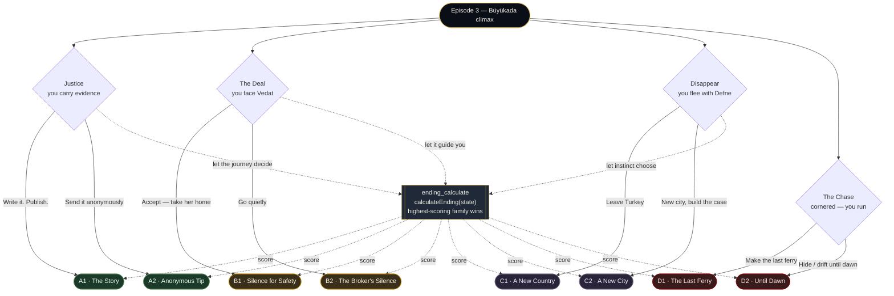

# Bosphorus Ferry — Endings Map (reference)

A visual reference for the eight end states and the paths that lead to each. The
game resolves to one of **8 endings**, grouped into **4 families** (A Justice,
B The Deal, C Disappear, D The Chase), each with two variants.

> Source of truth: `src/engine/endingCalculator.ts` (the weighted calculator) and
> the climax choices in `src/data/episode3.ts` (the direct links). Ending prose
> lives in `src/data/endings.ts`.

---

## The eight end states

| ID | Title | Family | Tone |
|----|-------|--------|------|
| **A1** | Justice — The Story | A · Justice | Triumphant, public; Deniz publishes, Vedat falls, Defne comes home |
| **A2** | Justice — The Anonymous Tip | A · Justice | Quieter justice; evidence delivered anonymously, slower but real |
| **B1** | The Deal — Silence for Safety | B · The Deal | Bittersweet compromise; Defne comes home, the network survives |
| **B2** | The Deal — The Broker's Silence | B · The Deal | Morally poisoned; two more years of silence, complicity bought |
| **C1** | Disappear Together — A New Country | C · Disappear | Exile; two sisters flee Turkey, alive but homeless |
| **C2** | Disappear Together — A New City | C · Disappear | Slow-burn justice from safety; case built from the Aegean coast |
| **D1** | The Chase — The Last Ferry | D · The Chase | Breathless escape; they flag down the last crossing home |
| **D2** | The Chase — Until Dawn | D · The Chase | Haunting, liminal; they drift / hide until the first ferry |

---

## How an ending is reached — two mechanisms

Every climax scene gives the player **explicit ending choices** *and* one
reflective **"let the journey decide"** option:

1. **Direct links** — a deliberate choice (`next: 'ending_a1'` … `'ending_d2'`)
   routes straight to that ending. *You choose your ending.*
2. **The calculator** — the *"let the journey decide / let it guide this moment"*
   choices route to the sentinel `next: 'ending_calculate'`, which calls
   `calculateEnding(state)` to pick the ending by **weighted score** over your
   flags, character axes, and NPC trust. *The sum of your journey chooses.*

> **Note (chase routing):** the two chase "drift / watch the stars" options used
> to route through the calculator, where a live chase could be re-scored into a
> calm *Disappear* (C2) ending. They now link directly to **D2 (Until Dawn)** —
> the ending the prose already narrates ("wash up, wait until dawn, the first
> ferry at six-fifty"). The calculator weights were deliberately **left
> unchanged** (see *Design notes*).

---

## The four character axes

Choices nudge four axes, each clamped to `[-1, +1]`. They are the calculator's
main steering signal on the *"let the journey decide"* paths.

| Axis | −1 | +1 |
|------|----|----|
| **approach** | cautious | bold |
| **trust** | guarded | open |
| **heart** | detached | empathetic |
| **method** | instinctive | methodical |

---

## The calculator — scoring per family

`calculateEnding(state)` scores all eight endings and returns the highest. If the
top score is below **3**, it falls back to **B1**.

**A · Justice** — `base = has_evidence_package·3 + found_vedat_ledger·2 + has_sude_photos·1.5 + has_vedat_letter·1 + method·2 + approach·1.5 + naz_trust·0.5 + sude_trust·0.5`
- **A1** `+1 if approach > 0.3` · `+1.5 if ruya_press_contact` · `ruya_trust·0.5`
- **A2** `+1 if approach ≤ 0.3` · `+1 if trust > 0` · `bora_trust·0.5`

**B · The Deal** — `base = trust·2.5 + 2 (if NOT compromised) + vedat_trust·0.5 + filiz_trust·0.5 + bora_trust·0.3`
- **B1** `+1.5 if approach < 0` · `+1 if heart > 0` · `+1 if found_defne`
- **B2** `+1 if |approach| < 0.3` · `+1 if method > 0`

**C · Disappear** — `base = found_defne·3 + heart·2.5 + defne_trust·1 + melis_trust·0.3 + 1 (if hakan_deal)`
- **C1** `+1.5 if method < 0` · `+0.5 if trust < 0`
- **C2** `+1.5 if method > 0` · `+1 if has_evidence_package`

**D · The Chase** — `base = compromised·3 + tayfun_alert·2 + spotted_by_tayfun·1.5 + approach·1.5`
- **D1** `+1.5 if method > 0` · `hakan_trust·0.5` · `irfan_trust·0.3`
- **D2** `+1.5 if method ≤ 0` · `+0.5 if heart > 0`

---

## Per-ending: the path that leads there

### A1 · Justice — The Story
- **Direct:** "Write the story yourself. Publish it." (the exposé climax) — needs gathered evidence.
- **Calculator:** strong evidence (`has_evidence_package`, `found_vedat_ledger`, `has_sude_photos`), high **method** & **bold approach**, and a press contact (`ruya_press_contact`).

### A2 · Justice — The Anonymous Tip
- **Direct:** "Send everything to the police anonymously." / "Go through the police. Keep it official."
- **Calculator:** the evidence base, but **cautious approach** (`≤ 0.3`) and **open trust** — patient justice over a public byline.

### B1 · The Deal — Silence for Safety
- **Direct:** "Accept — and take your sister home." / "Take the deal. Take her home."
- **Calculator:** high **trust**, **not compromised**, **cautious approach**, **heart > 0**, and you found Defne. *(Also the fallback ending when nothing scores ≥ 3.)*

### B2 · The Deal — The Broker's Silence
- **Direct:** "Go quietly. Get to the pier. Wait for the morning ferry."
- **Calculator:** high **trust**, **not compromised**, **balanced approach**, **methodical** — the colder compromise.

### C1 · Disappear Together — A New Country
- **Direct:** "Board the plane. Leave Turkey. Leave everything."
- **Calculator:** found Defne, high **heart**, **instinctive** (`method < 0`), **guarded trust** — flee on feeling.

### C2 · Disappear Together — A New City
- **Direct:** "Take Defne and the evidence. Disappear to the coast. Build the case from safety." / "Go. Build the case from safety."
- **Calculator:** found Defne, high **heart**, **methodical** (`method > 0`), and you hold evidence — flee, then expose from safety.

### D1 · The Chase — The Last Ferry
- **Direct:** "Chase the ferry. Flag it down. Make the last crossing."
- **Calculator:** `compromised` / `tayfun_alert` / `spotted_by_tayfun`, **bold approach**, **methodical**, captain trust (`hakan`, `irfan`).

### D2 · The Chase — Until Dawn
- **Direct:** "Hide in the cove until dawn." · "Cut the engine. Drift…" · "Sit in the boat… let it come." *(all three now link straight to D2)*
- **Calculator:** the chase flags + **bold approach**, **instinctive** (`method ≤ 0`), **heart > 0** — the haunting drift to first light.

---

## Design notes

- **The calculator is the "sum of your journey."** The deliberate player picks an
  ending outright; the reflective player who chooses *"let the journey decide"*
  is scored on everything they did. Both are first-class.
- **`found_defne` is a near-constant +3 to family C** because at the climax the
  protagonist is usually standing beside the sister they came to find. This makes
  **C the emotional default** for an unsteered player — by design, not by
  accident. A purely *random* walk therefore over-produces C2; a *deliberate*
  player is steered to their intended family by the axes (verified: justice → A,
  deal → B, find-and-flee → C, cornered → D all resolve correctly).
- **The calculator weights are intentionally left unchanged.** Re-weighting
  `found_defne` would endanger the narrow Deal/Flee score margins; the only real
  defect (a live chase resolving calm) was fixed narratively by re-pointing the
  two chase-drift choices to D2.
- **All eight endings remain reachable** via direct links; the calculator stays
  live through the six remaining *"let the journey decide"* branches.
